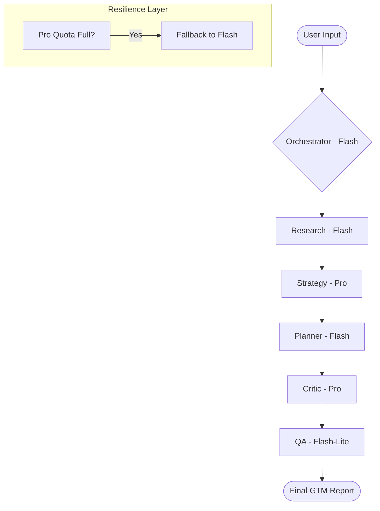

# Autonomous Multi-Agent Business Intelligence & Execution Platform

A production-style multi-agent AI workflow that orchestrates specialized agents to autonomously understand business contexts, research the market, generate strategies, plan execution, critique outputs, and perform quality assurance.

## 🎯 Project Overview

This project simulates a small AI-driven organization. The system coordinates multiple specialized AI agents to convert a simple business goal into a comprehensively researched, structured, and validated Go-To-Market strategy and execution plan.

The system emphasizes **observability**, **resilience (graceful degradation)**, and **memory** over complex infrastructure, resulting in a lightweight implementation capable of running locally on a standard laptop.

## 🏗️ Architecture Overview

The platform uses a custom orchestration layer inspired by CrewAI patterns to support fine-grained observability, fallback routing, real-time workflow visualization, and resilient execution handling. It uses a layered architecture to keep components clean, testable, and deterministic:

1.  **FastAPI Backend:** Handles asynchronous workflow execution and REST endpoints.
2.  **Streamlit Dashboard:** Progressive UI that provides live visualization of the multi-agent orchestration.
3.  **Agent Orchestrator:** Central controller orchestrating tasks sequentially with graceful fallback handling.
4.  **ChromaDB Memory Store:** Persistent, local vector database for semantic context retrieval and workflow memory compression.
5.  **Gemini Central Router:** Centralized routing of LLM calls matching agent roles to specific Gemini models.

### Multi-Agent Workflow



## 🤖 Agents & Model Routing

The system routes requests dynamically to different Gemini models based on the cognitive complexity required for each task:

| Agent | Model Primary | Model Fallback | Responsibility |
| :--- | :--- | :--- | :--- |
| **Research Agent** | `gemini-2.5-flash` | `gemini-2.5-flash-lite` | Synthesizes DuckDuckGo web searches into structured market data. |
| **Strategy Agent** | `gemini-2.5-pro` | `gemini-2.5-flash` | Generates advanced GTM and pricing strategies based on research. |
| **Planner Agent** | `gemini-2.5-flash` | `gemini-2.5-flash-lite` | Converts strategy into actionable sprints, tasks, and KPIs. |
| **Critic Agent** | `gemini-2.5-pro` | `gemini-2.5-flash` | Rigorously checks for hallucinations and logic gaps. |
| **QA Agent** | `gemini-2.5-flash-lite`| `gemini-2.5-flash` | Fast validation of JSON structure and report completeness. |
| **Memory Agent** | `gemini-2.5-flash-lite`| `gemini-2.5-flash` | Summarizes and compresses vector memory when tokens exceed limits. |

### Why these models?
*   **Pro:** Used for deep reasoning tasks (Strategy, Critique).
*   **Flash:** Used for high-context data synthesis and deterministic JSON generation (Research, Planning).
*   **Flash-Lite:** Used for ultra-low-latency, simple validation and memory compression operations.

## 🛡️ Resilience & Engineering Story

### The Fallback Router
AI workflows often fail due to rate limits or API timeouts. This system implements an automatic **Fallback Router**. If `gemini-2.5-pro` exhausts its daily free-tier quota, the system catches the `RESOURCE_EXHAUSTED` error, applies exponential backoff, and gracefully routes the request to `gemini-2.5-flash`.

This fallback mechanism ensures the workflow *never* crashes mid-execution. A degraded state (`COMPLETED_WITH_WARNINGS`) allows the demo to succeed continuously.

### Pydantic Output Schemas
To ensure cross-agent compatibility, all agents output structured data matching strictly defined Pydantic V2 schemas. The orchestration layer guarantees that downstream agents receive structured and predictable data.

### Thread-Safe Singleton ChromaDB
FastAPI's asynchronous nature can cause SQLite locking issues with local ChromaDB. The memory system is wrapped in a thread-safe Singleton with explicit write-locks, enabling safe concurrent memory operations across multiple background agents.

## 📊 Observability

Transparency is crucial in autonomous AI systems. The platform tracks:
*   **Live execution status:** Polled progressively without blocking the frontend.
*   **Agent tracking:** Identifies currently active and completed agents.
*   **Token tracking:** Computes token usage and cost-ceilings using a `CostTracker`.
*   **System logs:** View real-time agent output directly in the dashboard.

## 🚀 Setup Instructions

1.  **Clone and Install:**
    ```bash
    git clone https://github.com/Jigil-ak/autonomous-multi-agent-bi-platform.git
    cd autonomous-multi-agent-bi-platform
    python -m venv .venv
    .venv\Scripts\activate  # Windows
    pip install -r requirements.txt
    ```

2.  **Environment Variables:**
    Copy `.env.example` to `.env` and configure your API key.
    ```env
    GOOGLE_API_KEY=your_gemini_api_key_here
    ```

3.  **Run FastAPI Backend:**
    ```bash
    python main.py
    ```
    *The API will be available at http://localhost:8000*

4.  **Run Streamlit Dashboard:**
    Open a new terminal.
    ```bash
    .venv\Scripts\activate
    streamlit run frontend/app.py
    ```

## 📡 API Documentation

*   **`POST /analyze`**: Submit a business payload. Returns a `task_id` (HTTP 202).
*   **`GET /status/{task_id}`**: Poll for real-time progress and active agent states.
*   **`GET /logs/{task_id}`**: Fetch raw execution logs for observability.
*   **`GET /report/{task_id}`**: Fetch the final JSON report or saved replays.

## 🔮 Future Improvements
*   **Parallel Execution:** Run Research and Strategy agents asynchronously.
*   **Human-in-the-Loop:** Implement WebSockets to allow manual strategy adjustments mid-workflow.
*   **Multi-Tenancy:** Migrate ChromaDB to a managed cloud vector database.